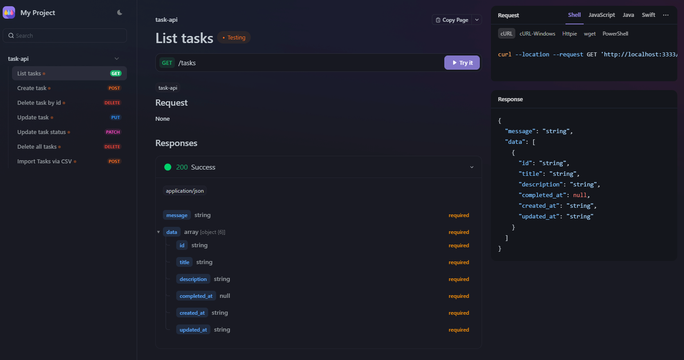

# 📌 Projeto: Task API

Uma API RESTful desenvolvida com Node.js para gerenciamento de tarefas, permitindo operações como criação, listagem, atualização, exclusão e importação de tarefas via CSV.

## 🚀 Funcionalidades

- **Listar Tarefas**: Recupera todas as tarefas cadastradas.
- **Criar Tarefa**: Adiciona uma nova tarefa com título e descrição.
- **Atualizar Tarefa**: Modifica o título e a descrição de uma tarefa existente.
- **Atualizar Status da Tarefa**: Altera o status de conclusão de uma tarefa.
- **Deletar Tarefa**: Remove uma tarefa específica pelo ID.
- **Deletar Todas as Tarefas**: Remove todas as tarefas cadastradas.
- **Importar Tarefas via CSV**: Permite a importação em massa de tarefas a partir de um arquivo CSV.

## 🛠️ Tecnologias Utilizadas

- [Node.js](https://nodejs.org/)
- [Express](https://expressjs.com/)
- [Apidog](https://apidog.com/) para documentação e testes da API

## 📄 Documentação da API



A documentação completa da API está disponível em: [https://apidog.com/apidoc/shared/6bcd62ee-fcaf-4ac4-b409-b9d7603692a5](https://apidog.com/apidoc/shared/6bcd62ee-fcaf-4ac4-b409-b9d7603692a5)

## ⚙️ Instalação e Execução

1. **Clone o repositório:**

   ```bash
   git clone https://github.com/eduardoraraujo/task-api
   cd task-api
   ```

2. **Instale as dependências:**

   ```bash
   npm install
   ```

3. **Inicie o servidor:**

   ```bash
   npm run dev
   ```

   O servidor estará disponível em `http://localhost:3333`.

## 📬 Endpoints Principais

- `GET /tasks`: Lista todas as tarefas.
- `POST /tasks`: Cria uma nova tarefa.
- `PUT /tasks/:id`: Atualiza uma tarefa existente.
- `PATCH /tasks/:id/complete`: Atualiza o status de conclusão de uma tarefa.
- `DELETE /tasks/:id`: Deleta uma tarefa específica.
- `DELETE /tasks`: Deleta todas as tarefas.
- `POST /tasks/import`: Importa tarefas a partir de um arquivo CSV.

## 📌 Observações

- Certifique-se de que o Node.js está instalado em sua máquina.
- Utilize ferramentas como [Postman](https://www.postman.com/) ou [Apidog](https://apidog.com/) para testar os endpoints da API.
